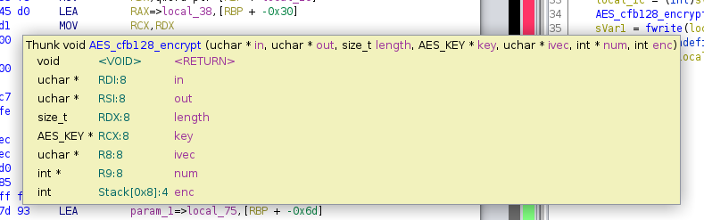
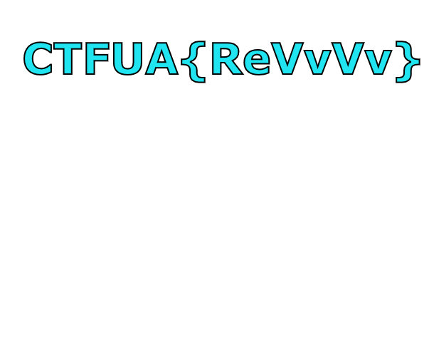

# backwards

> Description:

We have `a.out` ELF, and `enc.enc`, some encrypted data.\
Opening `a.out` in Ghidra we clearly see in the main function that it's taking some files in input, and applying AES-CFB-128 encryption.

```c
  local_10 = fopen(*(char **)(param_2 + 8),"r");
  local_18 = fopen(*(char **)(param_2 + 0x10),"w");
  local_68 = 0x6979656b73696874;
  local_60 = 0x6461627972657673;
  local_58 = 0;
  local_75 = 0x74657375746e6f64;
  local_6d = 0x69736968;
  local_69 = 0;
  AES_set_encrypt_key((uchar *)&local_68,128,&local_178);
  local_17c = 0;
  do {
    sVar1 = fread(local_38,1,0x10,local_10);
    local_1c = (int)sVar1;
    AES_cfb128_encrypt(local_38,local_48,(long)local_1c,&local_178,(uchar *)&local_75,&local_17c,1);
    sVar1 = fwrite(local_48,1,(long)local_1c,local_18);
    local_20 = (undefined4)sVar1;
  } while (0xf < local_1c);
  return 0;
```

Looking at the arguments of `AES_cfb128_encrypt()` function we see that it takes key at 4th parameter, IV at 5th parameter, but easier we could just patch the last arguments that appear to be encryption mode: 0x1 to encrypt, 0x0 to decrypt.

<figure><figcaption></figcaption></figure>

So patch this instruction:

```
0010126e 6a 00  PUSH  0x1
```

to:&#x20;

```
0010126e 6a 00  PUSH  0x0
```

```shell
$ ./a.out.patched enc.enc flag && file flag
flag: PNG image data, 603 x 500, 8-bit/color RGBA, non-interlaced
```

The decrypted enc.enc it's a png file.

```shell
eog flag
```

<figure><figcaption></figcaption></figure>

> ```
> CTFUA{ReVvVv}
> ```
